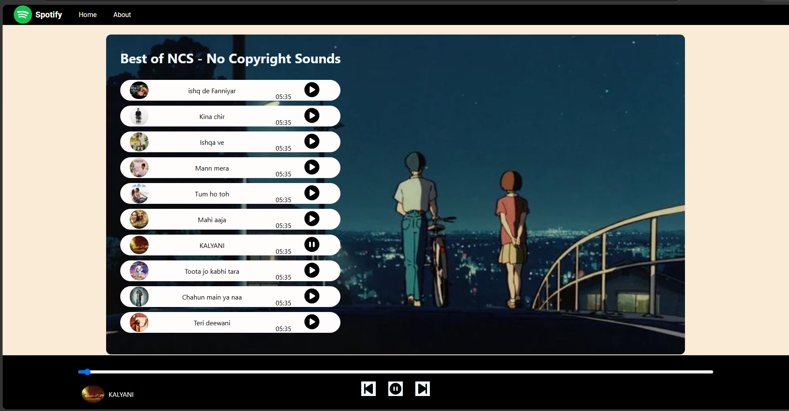

# Spotify Music Player

A responsive music player website built using HTML, CSS and JavaScript.

## Features

-  Play / Pause songs
-  Next / Previous song
-  Multiple songs
-  Song images
-  Progress bar
-  Responsive design
-  Dynamic song switching

## Technologies Used

- HTML
- CSS
- JavaScript

## Project Screenshot

## Author

Vaidik Kumar